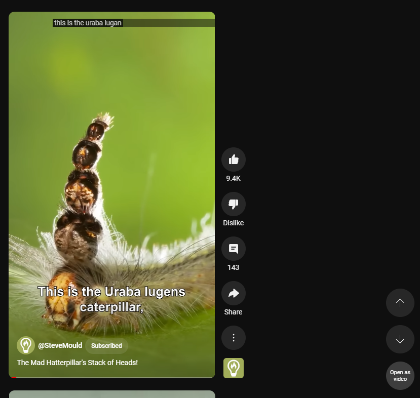
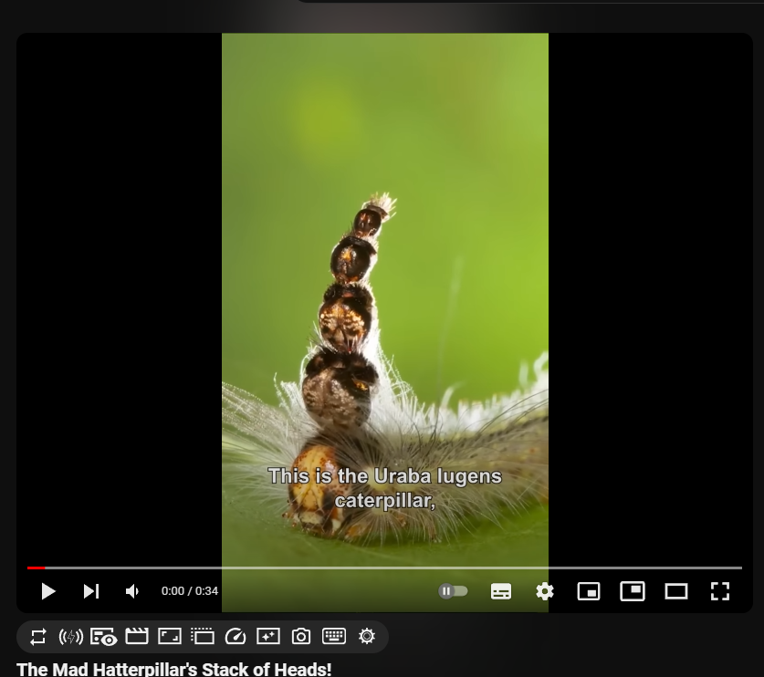

# YouTube Shorts Control

YouTube Shorts Control is a usefull browser extension that enhances your YouTube Shorts experience by adding a custom button to easily switch to the full video view. This way, you can watch Shorts like regular YouTube videos (use video progress bar, speed control etc.). 

## Features

- Adds a "Open as video" button to YouTube Shorts pages.
- Clicking the button redirects to the full video view, pausing the video on the current page and opening the video in a new tab for a seamless experience.
- Gives you more control over the video you watch.

## Screenshots

*The "Open as video" button displayed on a YouTube Shorts page.*

*After clicking the "Open as video" button, you can watch Shorts as a regular video.*

## Installation

1. [Download the extension ZIP file](https://github.com/numbersanalyst/yt-shorts-control/archive/refs/heads/main.zip).
2. Extract the ZIP file to a location of your choice.
3. Open your Chrome browser and go to `chrome://extensions/`.
4. Enable "Developer mode" in the top right corner.
5. Click on "Load unpacked" and select the folder where you extracted the ZIP file.

## How to use

1. Visit a YouTube Shorts page.
2. After the page loads, you should see the "Open as video" button added to the page.
3. Click the button to switch to the full video view in a new tab.

## License

This project is licensed under the [MIT License](LICENSE).

## Contribution

Contributions are welcome! Feel free to submit issues or pull requests.

## Disclaimer

This extension is an independent project created to enhance the YouTube Shorts experience. It is not affiliated with or endorsed by YouTube. Use it at your own risk.